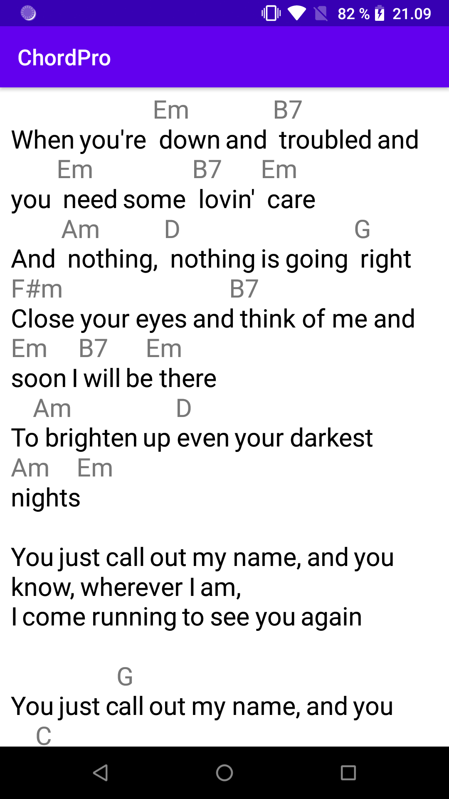

# ChordPro-Android

Custom Android TextView that supports drawing chords as defined in the [ChordPro format](https://www.chordpro.org/).

The screenshot above was based on this input text:
> When you're [Em] down and [B7] troubled and you [Em] need some [B7] lovin' [Em] care  
> And [Am] nothing, [D] nothing is going [G] right  
> [F#m]Close your eyes and [B7]think of me and [Em]soon I [B7]will be [Em]there  
> To [Am]brighten up [D]even your darkest [Am]nights [Em]  
> 
> You just call out my name, and you know, wherever I am,  
> I come running to see you again
> 
> You just c[G]all out my name, and you kn[C]ow, wherever I am,  
> I come r[G]unning to see you [Am]aga[D7]in  
> [G] Winter spring summer or [G7] fall [C] all you got to do is [Am] call  
> And I'll [C] be there, yes I [Am] will

See the sample in the code.

### Licensing
The project is licensed under the Apache License, Version 2.0. See the [LICENCE](LICENSE) file.
